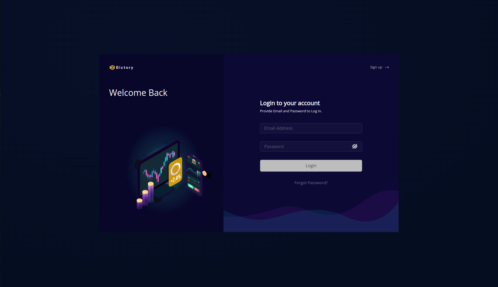
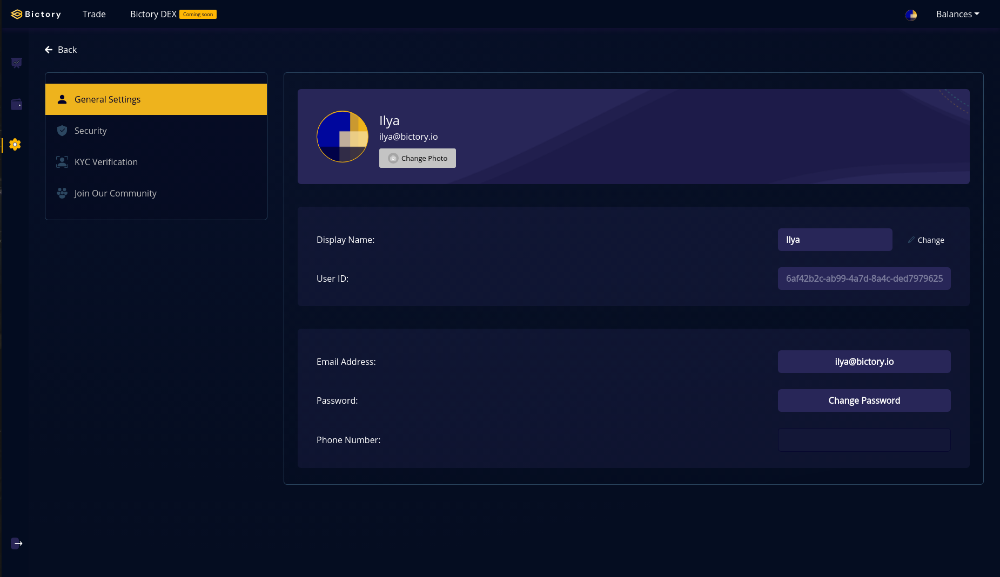
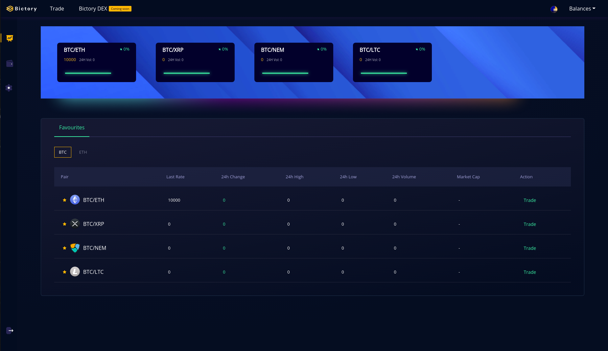
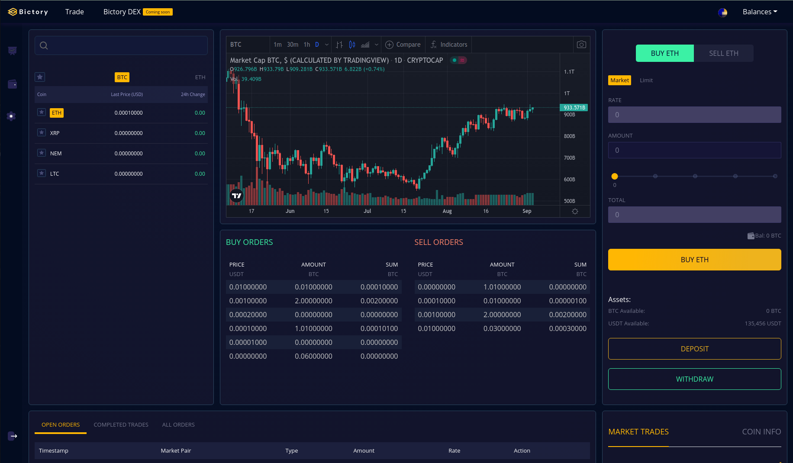

## Project name
The name of the project is: Bictory Finance (Bictory.io)

## Project overview
 
### General
Bictory Finance is building a CEX (centralized exchange), and we will be utilizing the Concordium blockchain by listing GTU, custom Concordium issued tokens, wrapped tokens, and other network tokens. Our CEX will leverage Concordium identity layer for the KYC of every user. 

By bringing to life CEX, Bictory will promote Concordium technology as a 
working proof because of the applications built on top of it. Furthermore, Concordium will showcase its scalability and regulatory ready solutions. It will allow users worldwide to interact with Concordium as a technology and the native GTU token as well as  new tokens issued or other network tokens wrapped and issued on top of it. Every user of CEX will need to register at either Concordium mobile app or desktop wallet in order to create ID and Pass KYC requirement.

Our integration with the Concordium blockchain will be work by maintaining concordium-nodes (HA). Bictory application's backend servers will communicate with concordium-nodes through the API. API will wrap a gRPC interface exposed by the concordium-node. Our user, to pass KYC, will upload the JSON id to our CEX. Once the Concordium mobile wallet is released, it will be much easier as the user will be able to utilize a QRcode for this process. 

Our team has vast experience in blockchain projects, security, and scalability, and we are excited about the Concordium blockchain identity layer. This process will provide fast confirmation
and multilanguage smart-contracts (wasm target compatible). We see this as an opportunity to build a needed product on new top-notch emerging technology.

### Description 
Following the "reverse-engineering" approach, we can describe our final CEX product as 
secure, scalable, reliable, and fast with legitimate permission to operate. 
Each feature passed our internal security review, and we continuously check our project dependency for CVE. Each of our developers is familiar with OWASP(Open Web Application Security Project). Our auto-scalable architecture allows us to keep going with a high load and release resources when they are not needed. For new region expansion, we have a well-defined terraform file set (IaC). Each part of the backend system issues logs, and we are checking on system health with Grafana. 
Our UI/UX is the result of long-term A/B testing, and the login process will be simplified to scan a QR-code with the Concordium app. Having a "Built-in" KYC will help us lower fees for our users as we will not need to pay a 3rd party for KYC. This KYC using Concordium's ID layer will also make us compliant with vast government regulations.

Here are our steps to reach this goal in our reverse engineering process:
* Writing IaC to provision infrastructure in new regions   
* 24h DevOps support by in 3 shifts
* Penetration testing
* Checking system performance for bottlenecks and rewrite some code in Rust   
* Many different benchmarks
* Configuration of Grafana for easy data analysis
* Our cloud-based infrastructure fully provisioned from code (IaC)
* Setting up A/B testing       
* Code refactored
* Adding features and testing
* Product owners update features and set new priorities. 
* Production env deployed, tested & fixed
* POC ready
* Production env provisioned and CI/CD pipeline updated
* Added swagger comments for endpoints, code coverage >90% by automatic tests
* Software architecture keeps supervision of POC, and we are working on a detailed design for dedicated parts of the system  
* We have well defined CI/CD pipeline process on GitLab with a full range of code checks, from style to static code analysis
* Frontend and backend teams agree on the API, Frontend working on UI and getting data from the API stub. Backend provisions staging env in the cloud, write dockerfiles, and docker creates a file to set up local development env.
* We defined the initial CI/CD pipeline process on GitLab, a defined code review process, and an agile approach to project management 
* Software architecture has begun analysis and prepared a high-level design for POC   
* We have created mockups, discussed ideas, and our product owner populated our backlog with user stories 
* We have a strong plan and a good idea of where we are going with our CEX

Current problems/issues you are encountering:
* We are currently hiring a project manager to keep the development process more organized. 

How could Concordium help you?:
* We can work together on requirements and the definition of a compliant authentication/KYC 
process through the Concordium wallet. We will be beta testers in the implementation of this feature. We can work hand in hand to showcase Concordium's use cases, for example low transaction fees and fast tps. We plan to use Concordium bridge to bring other network tokens to Concordium ecosystem by wrapping them and ensuring liquidity. 

### Submission
* You can access CEX UI at http://3.12.144.216/ (This is an internal deployment). Please don't try to use real tokens; this CEX is running on the testnet. After registration, a confirmation email will be sent. If you don't see it, please check your spam folder.

  

  

  

  

### Benchmark

Please name the projects you are competing with: 

### Team

Development team (Backend & Frontend)
* https://github.com/Elam-Harnish
* https://ng.linkedin.com/in/paschal-obba-a7222aa2
* https://gitlab.com/udori
* https://www.linkedin.com/in/rafael-scrooppi/
* https://www.linkedin.com/in/shakhzod-ayibjonov

Core team
* [Jakhongir Sulaymonov - Project Lead (Founder)](https://www.linkedin.com/in/joha-j-sulaymonov-523299117/)
* [Agbona Igwemoh - Operations Lead (Co-Founder)](https://www.linkedin.com/in/agbona/)
* [Shuxin Pan - Technical Project Manager](https://www.linkedin.com/in/sue-anne-pan-0609203b/)
* [Wisdom Augustine - Senior Product Designer](https://www.linkedin.com/in/wisdom-augustine-929548164/)

Marketing team
* [Benjamin Marchant - Marketing Lead](https://www.linkedin.com/in/jammin1/)
* [Kelvin Emmra - Community Marketing Manager](https://www.linkedin.com/in/kelvin-emmra-211918178/)

Advisory Team
* [Dylan Dewdney (CEO - NFT3, Kylin Network) - Advisor/Investor](https://www.linkedin.com/in/dylan-dewdney/)
* [Kristjan Kosic (CTO - Protokol) - Strategic/Tech Advisor](https://www.linkedin.com/in/kristjankosic/)
* [Lars Rensing (CEO/Co-Founder - Protokol) Strategic Advisor](https://www.linkedin.com/in/larsrensing/)

### Website
https://bictory.io

### Legal

## Development 
Roadmap: 
### Overview
* Total Estimated Duration: Duration of the whole project (i.e 32 weeks)
* Full-Time Equivalent (FTE): 40
* Total Costs: $99k. 

### Milestone 1
* ED: 10 weeks
* FTE: 12
* Cost: $45,000 

| Action| Deliverable | Specs |
| -------- | -------- | -------- |
| 0.1   | License     | MIT    |
| 0.2   | Documentation     | Technical documentation   |
| 0.3   | Concordium-backend bridge     | Backend code connected to concordium-node throw gRPC wrapper   |
| 0.4   | Infratsructure for support of any new token     | Alpha Release of token adapter.      |
| 0.5   | KYC     | Check user identity. User upload JSON     |
| 0.6   | GTU support on DEX     | Deposite/withdraw/sell/buy functionality    |
| 0.7   | System benchmark     | System stress test, check system under load    |
| 0.8   | Penetration test     | Penetration test by 3rd party and our CISO   |

### Milestone 2
* ED: 10 weeks
* FTE: 14
* Cost: $22,500

| Action| Deliverable | Specs |
| -------- | -------- | -------- |
| 0.7   | Backend dashboard     | Development of Backend dashboard     |
| 0.8   | Documentation: Login/KYC through Concordium mobile wallet     | Cooperate with Concordium define API for Login/KYC functionality     |
| 0.9   | Login/KYC through Concordium mobile wallet implementation     | First implementation on feature   |
| 1.0   | Custom token support on DEX     | Deposit/withdraw/sell/buy functionality for custom token issued on Concordium blockchain |
| 1.1   | Ticket system integration     | Integration with 3rd party backend system |

### Milestone 3
* ED: 12 weeks
* FTE: 14
* Cost: $32,000

| Action| Deliverable | Specs |
| -------- | -------- | -------- |
| 1.2   | Legal opinion     | Legal opinion     |
| 1.3   | Regulatory compliance     | GDPR compliance, automatic archiving of financial info  |
| 1.4   | Identity Revoking anonymity     | Functionality for revoking anonymity in response from court request    |

### Community and marketing
Our mission is to develop a suite of financial products that enable developers, liquidity providers, creators, and traders on Concordium to raise capital, trade crypto, and provide liquidity in a way the ensures compliance. Bictory Finance intends to utitilze Concordium and the ID layers so that we are ready for regulations that will surely come to this industry. The Bictory Finance Community will play a vital role in developing our global support system, by referring more users to join the budding community. Early BT tokens purchases as well as early community supporters will be the first to try out our Centralized Exchange in our upcoming Alpha launch. Along with this, they will be the first to try out the Concordium ID layer KYC and login process once integrated into the CEX system.

Bictory Finance has released an article previously that captures the reasons behind why the ID layer is so vital: [https://bictory-finance.medium.com/bictory-leverages-identity-layer-on-concordium-dc0875dfb9ea](https://bictory-finance.medium.com/bictory-leverages-identity-layer-on-concordium-dc0875dfb9ea)

We have also released an article detailing our CEX and DEX. Here you can find information regarding our CEX: [https://bictory-finance.medium.com/bictory-cex-and-dex-in-focus-4eb2a95c7f5a](https://bictory-finance.medium.com/bictory-cex-and-dex-in-focus-4eb2a95c7f5a)

Here you can view a video about Bictory Finance created by one of our partners at MarketSquare: [Bictory Finance Introduction from MarketSquare](https://youtu.be/P7DX7m6p2s8)

Bictory Finance has an active marketing team that has already begun to build our community. We have introduced Bictory to the world through AMAs, press releases, articles, videos, and partnerships. We will be creating a story surrounding Bictory Finance and why our technologies set us apart from the competition.  

### What's next?
Please add here what ever makes sense for your future activities. 

