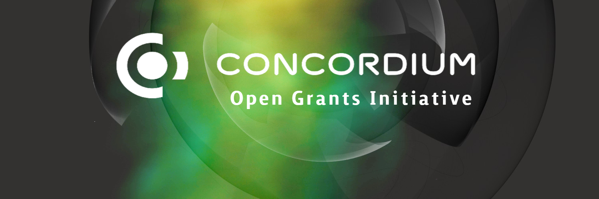

# Concordium Open Grants Initiative <!-- omit in toc -->

Concordium Foundation Open Grants Initiative

  

> **:loudspeaker:** The Concordium Foundation Open Grants Initiative focuses on technology grants of upto $20,000 for the grants which are tracked transparently on Github and disbursed in **USDT or Fiat Currency**. For larger Grants Program please watch out for further announcements on our Github/Official communication channels. 

---

- [:wave: Introduction](#wave-introduction)
  - [Guidelines](#guidelines)
  - [Project ideas](#project-ideas)
  - [Support](#support)
  - [Team](#team)
    - [Concordium Grants Committee](#Concordium-grants-committee)
    - [Concordium Grants Evaluators](#Concordium-grants-evaluators)
    - [Concordium Operations Team](#Concordium-operations-team)
- [:pencil: Process](#pencil-process)
- [:bulb: Help](#bulb-help)
  - [Additional information](#additional-information)
  - [Real-time conversation](#real-time-conversation)
- [:rocket: Alternative Funding Sources](#rocket-alternative-funding-sources)
  - [Treasury](#treasury)
  - [Galaxy Grants Program](#Galaxy-grants-program)
  - [Hackathons](#hackathons)
  - [Other Grant Programs](#other-grant-programs)

## :wave: Introduction

In the journey of creating amore transparent and meaningful world, we offer an Open grants initiative focused on funding software development and research efforts related to **Meaningful building within the Concordium Ecosystem**. For more information about the Concordium Foundation, please visit the [About page](https://concordium.com/foundation/) on our website.

The Concordium Open Grants Initiative tries to achieve the above while being:

- fully open & transparent,
- simple, and
- effective.

### Guidelines

Anyone is welcome to apply for a grant. Projects funded through our programs are generally broad in scope, but our focus lies on strong technical projects that add value to the ecosystem.

Generally, your project will have better chances to get accepted if:

- It presents a **well-researched** or tested concept, for which ideally you are able to show some prior work.
- You can demonstrate that the project will be **maintained** after completion of the grant, be it through an obvious commitment to the technology from your side, additional funding sources or an existing business model.
- Your team has **proven experience** with the relevant languages and technologies and/or a strong technical background. We ask you to provide the GitHub profiles of all team members as part of your application and will examine these for past activity and code quality. Naturally, you can also link to projects on other platforms.
- Your application is **rich in technical details** and well-defined.
- You can clearly present how your project stands out among competitors or implements technology that doesn't exist in the ecosystem yet.

Additionally, it must fulfill the following requirements:

- All code produced as part of a grant must be **open-sourced**, and it must also not rely on closed-source software for full functionality. We prefer Apache 2.0, but GPLv3, MIT or Unlicense are also acceptable.
- We do not award grants for projects that have been the object of a successful token sale.
- As a general rule, teams are asked to finish a grant before applying for another one.
- Lastly, we do not fund projects that actively encourage gambling, illicit trade, money laundering or criminal activities in general.

In addition to the information provided on your application, note that your project will need to comply with our [Guidelines for Milestone Deliverables](https://github.com/Concordium/Concordium-Open-Grants-Initiative/blob/master/grants/milestone-deliverables-guidelines.md). In particular, we require all projects to create documentation that explains how their project works. At a minimum, _written_ documentation is required for funding. Tutorials or videos are also helpful for new users to understand how to use your product. If your team's background is purely technical, consider hiring a freelance or part-time technical writer as part of the grant.

We also have [Announcement Guidelines](https://github.com/Concordium/Concordium-Open-Grants-Initiative/blob/master/grants/announcement-guidelines.md) for grant-related communications.

Finally, we take licensing and the right of all teams in and outside the ecosystem to be recognised for their work very seriously. Using others' work with no attribution or indication that this was not your own work as part of a milestone delivery **will lead to immediate termination**. Please reach out to us before submitting if you have any doubts on how to comply with a specific license and we'll be happy to help.

### Project ideas

An overview of existing projects in the Concordium Ecosystem along with broad project ideas we would potentially be interested in funding can be found [here](grants/Concordium_stack.md), as well as a list of previously accepted applications [here](grants/accepted_grant_applications.md). Additionally, the DevX Initiative Feedback [feedback board](https://feedback.devxinitiative.org/) may contain some useful ideas for grant projects.

[Requests For Proposals](rfps) (RFPs) represent concrete ideas for projects that we would like to see implemented. Several teams may apply for the same RFP, so even if another team has already applied to implement a certain RFP, we invite you to do the same if you're interested.

Finally, you don't need to start your own project in order to be eligible for a grant. Instead, some teams choose to port existing work to Substrate, where the pertinent licenses allow, or to contribute to an existing open-source project. In the latter case, you should check in advance that the maintainers of the project are interested in your contribution, and the acceptance of the milestones will generally be tied to the inclusion of your work in said project.

If you have a **good concept of the technical challenges** that your idea entails and would like feedback before applying, you can send us an [email](mailto:grants@concordium.com) and tell us about it.

### Support

The scope of our Grants Programs consists of funding and feedback on delivered milestones. This means that we do not provide hands-on support as part of a grant, but if you face specific issues during development, we will do our best and try to direct you to the correct resources. If this sounds like something you would like however, you may also want to apply to DevX Initiative Innovate [DevX Initiative Innovate](https://www.devxinitiative.org/innovate/), which provides hands-on technical, ecosystem and strategical long-term support and access to extensive resources. You can find general documentation and more information on DevX on the [DevX Initiative Developer Hub](https://devxinitiative.dev/), and we encourage you to join the [community](https://devxinitiative.dev/en/community) in order to get help with specific issues or to stay up to date with the most recent developments.

For questions about the grants program itself, see our [FAQ](grants/faq.md#frequently-asked-questions).

## :pencil: Process  

1. **Application**

    We strongly recommend working off of the [grant application template](./grants/grant_application_template.md), which gives an indication of what a good roadmap should look like and outlines the criteria and information we look for in an application.

    Partially public applications that limit financial information (i.e. the requested funding amount) to the application form in step `ii.` are preferred. However, teams are free to make fully public applications as well as fully private applications.

    1. **Fully or partially public** applications should be initiated with a pull request to this repository by following the steps below. Teams who intend to make a fully private application can skip this step.
        1. [Fork](https://github.com/Concordium/Concordium-Open-Grants-Initiative/fork) this repository.
        2. In the newly created fork, create a copy of the application template ([`grants/grant_application_template.md`](grants/grant_application_template.md)). If you're using the GitHub web interface, you will need to create a new file and copy the [contents](https://raw.githubusercontent.com/Concordium/Concordium-Open-Grants-Program/master/grants/grant_application_template.md) of the template inside the new one. Make sure you **do not modify the template file directly**. Name the new file after your project: `project_name.md`.
            - In the few cases where your application is in response to a specific RFP, you should create the file inside the [`rfp-responses`](grants/rfp-responses) folder.
            - All other applications go into the [`speculative`](grants/speculative) folder.
        3. Fill out the template with the details of your project. The more information you provide, the faster the review. To get an idea of what a strong application looks like, you can have a look at the following examples:  [1](https://github.com/Concordium/Concordium-Open-Grants-Initiative/blob/master/applications/project_example.md). Naturally, if you're only applying for a smaller grant that only consists of, say, UI work, you don't need to provide as much detail.
        4. Once you're done, create a pull request. The pull request should only contain _one new file_—the Markdown file you created from the template.
        5. You will see a comment [template](.github/PULL_REQUEST_TEMPLATE.md) that requests an abstract of the project and provides a checklist. Please complete these as appropriate. You can tick the items in the checklist once the PR has been created.
    2. Fill out the General Grants application form [:arrow_right: here](https://docs.google.com/forms).

2. **Application Review**
   - The Concordium Foundation will review the application, determine if more information is required and potentially schedule a call with the team.
   - Concordium AG may assist in the review of some applications.

3. **Decision**
   - Applicants will be notified via email of whether their proposal has been accepted or not.
   - If a proposal is successful, further communication will be required to determine specific details around timelines and payment schedules.

4. **Follow-up**
   - Once work on the project has started, the Concordium Foundation will want to have follow-up conversations to see how the project is progressing.
   - To help speed up the milestone evaluation process, take a look at the [Guidelines for Milestone Deliverables](grants/milestone-deliverables-guidelines.md). Milestones will be evaluated based on this document and the details provided in your application.

## :mailbox_with_mail: Request for Proposals (RFP) Suggestions

If you think that we should support the development of certain tools or projects (related to **Concordium Ecosystem**) that aren't in the Concordium [tech stack](grants/Concordium_stack.md), feel free to submit an RFP suggestion using the process described below. We are particularly interested in supporting projects that could be leveraged by other builders in our ecosystem. We will review your proposal and, if we believe it’s useful, will create an RFP based on your idea and try to find teams to work on it.

**Instructions for submitting an RFP suggestion:**

1. [Fork](https://github.com/Concordium/Concordium-Open-Grants-Program/fork) this repository.
2. In the newly created fork, create a copy of the suggestion template ([`rfps/suggestion-template.md`](rfps/suggestion-template.md)) inside the [`rfps`](rfps) folder. Make sure you create a new file and copy the [contents](https://raw.githubusercontent.com/Concordium/Concordium-Open-Grants-Program/master/rfps/suggestion-template.md) of the template inside the new one, and _do not modify the template file directly._
3. Name the file after your idea: `project_name.md`.
4. Fill out the template with the project details. Please include as many details as possible.
5. Once you're done, click on "Create new pull request". The pull request should only contain _one new file_—the Markdown file you created from the template.
6. You will see the same template as for creating an application. Plase replace it with [this one](.github/PULL_REQUEST_TEMPLATE/rfp_pr_template.md).

If you have an idea for a project but lack the technical background to create a detailed outline, you can open an [issue](https://github.com/Concordium/Concordium-Open-Grants-Program/issues/new) instead or add it to the [tech stack](grants/Concordium_stack.md) as a potentially interesting project. However, your idea will have better chances of being implemented if you can provide a project outline such that it can be picked up straight away by a capable team.

## :bulb: Help

### Additional information

|  |  |  |  |  |  |
| :-: | :-: | :-: | :-: | :-: | :-: |
| [Concordium Foundation Website](https://concordium.com) | [Concordium Twitter](https://twitter.com/ConcordiumNet) | [Concordium Medium](https://medium.com/@concordium) | [Concordium Wiki](https://wiki.concordium/en/) | [Concordium Reddit](https://www.reddit.com/r/Concordium_Official/) | [Concordium YouTube](https://www.youtube.com/channel/UCPZc2CuB2jGbZjD_5zX7-1A) |

### Real-time conversation

We have Element channels for real-time discussions on Concordium. Join the conversation.

- [Concordium](https://t.me/concordium_official)
- [Concordium Gitter](https://gitter.im/concordium_official/community)

## :rocket: Alternative Funding Sources

Some funding sources might be more and some less suitable for your project throughout its various stages. We encourage you to explore alternative funding options listed below. Please note, however, that you should not seek to fund the **same scope of work** from multiple sources and that any team found doing so will have its Concordium Foundation support terminated.

### Treasury

The treasury is a pot of on-chain funds collected through transaction fees,part of the baking rewards , staking inefficiencies, etc. The funds held in the treasury can be spent on spending proposals.[Concordium](https://concordium.com) offers everyone the opportunity to apply for funding via the treasury. See:

- [Treasury Wiki](https://wiki.concordium.com/docs/en/learn-treasury)
- [ Concordium Treasury Guide](https://docs.google.com/document)

### Open Grants Program

Our [DevX Initiative Grants](https://github.com/The-DevX-Initiative/DevX-Grants-Program) is suited for technology grants of up to $30,000, which are tracked transparently on GitHub and disbursed in USDT or fiat.

### Hackathons

From time to time, Concordium Foundation and/or Concordium AG organise hackathons to promote quick prototyping of Concordium related ideas. We highly encourage you to participate in these hackathons. Bear in mind, however, that you cannot submit the **same work** for a hackathon and the Grants Program. If you have worked on a project for a hackathon, your grant application should either propose a new set of features or otherwise build on top of your previous work. The same applies in reverse, although that will likely be less common.

### Other Grant Programs

Below is a list of other grant programs in the Concordium ecosystem:

## :information_source: License <!-- omit in toc -->

[Apache License 2.0](LICENSE) © Concordium Foundation
