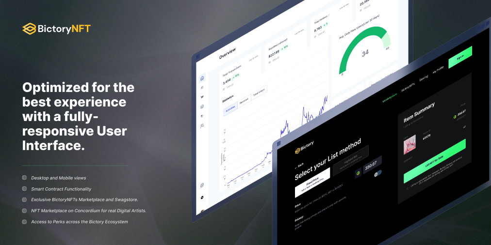
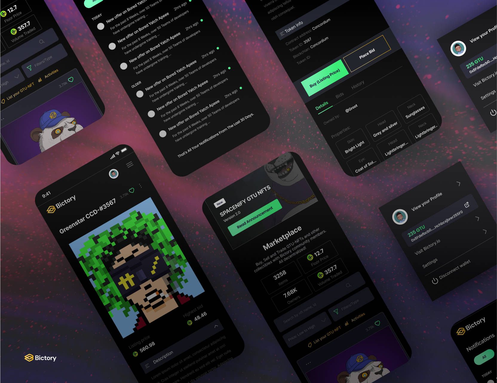

  

## Project name
The name of the project is: Bictory NFT

## Project overview
 
### General
Bictory Finance is building a curated and exclusive NFT platform for minting NFTs on Concordium. Among minting capabilities, BictoryNFT will release a premium NFT collection called “Terrestria”, NFT holders will enjoy perks, discounts, and exclusive access to Bictory’s suite of products. 

By bringing to life our NFT platform, Bictory will promote Concordium technology and its Smart Contracts capability as a working proof because of the applications built on top of it. Furthermore, Concordium will showcase its scalability and regulatory-ready solutions. It will allow users worldwide to interact with Concordium as a technology and the native CCD token. Every user of the NFT platform will need to register on either the Concordium mobile app or the desktop wallet to create an ID and Pass the KYC requirement.

NFT Smart Contract will comply with the Concordium Network's CIS1 standard. 

Our integration with the Concordium blockchain will work by maintaining concordium-nodes (HA). Bictory application’s backend servers will communicate with concordium-nodes through the API. The API will wrap a gRPC interface exposed by the concordium-node. 

Our team has vast experience in blockchain projects, security, and scalability, and we are excited about the Concordium blockchain and its smart-contracts capability. We see this as an opportunity to build a needed product on new top-notch emerging technology.

### Description 
Following the “reverse-engineering” approach, we can describe our final NFT platform as a secure, scalable, reliable, and fast service for NFT minting, buying, and selling. Each feature passed our internal security review, and we are continuously checking our project dependency for CVE. Our developers are familiar with OWASP(Open Web Application Security Project). Our auto-scalable architecture allows us to keep going with a high load and release resources when needed. For new region expansion, we have a well-defined terraform file set (IaC). Each part of the backend system issues logs, and we are checking on system health with Grafana. Our UI/UX is the result of long-term A/B testing.

Here are our steps to reach this goal in our reverse engineering process:
* Writing IaC to provision infrastructure in new regions.
* 24h DevOps support in 3 shifts
* Penetration testing
* Checking system performance for bottlenecks and rewriting some code in Rust
* Many different benchmarks
* Configuration of Grafana for easy data analysis
* Our cloud-based infrastructure is fully provisioned from code (IaC)
* Setting up A/B testing
* Code refactored
* Adding features and testing
* Product owners update features and set new priorities.
* Smart-contract deployed and instantiated to the Concordium MainNet
* Production env deployed, tested & fixed.
* POC ready
* Production env provisioned and CI/CD pipeline updated.
* Added swagger comments for endpoints, code coverage >90% by automatic tests
* Software architecture keeps supervision of POC, and we are working on a detailed design for dedicated parts of the system.
* We have well defined CI/CD pipeline process on GitLab with a full range of code checks, from style to static code analysis.
* Smart-contract deployed and instantiated to Concordium testnet
* Frontend and backend teams agree on the API, Frontend working on UI and getting data from the API stub. Backend provisions staging env in the cloud writes dockerfiles, and docker creates a file to set up local development env.
* We defined the initial CI/CD pipeline process on GitLab, a defined code review process, and an agile approach to project management.
* Software architecture has begun analysis and prepared a high-level design for POC.
* We have created mockups, discussed ideas, and our product owner populated our backlog with user stories.
* We have a strong plan and a good idea of the direction we are taking for BictoryNFT.

Current problems/issues you are encountering:
* Finalization of NFT’s Meta-data schema
* CryptoX wallet integration
* Spaceseven integration 

How could Concordium help you?:
* Concordium could help us understand the best way to add various functionalities in smart contracts.
### Submission

  

### Benchmark

Please name the projects you are competing with: 

Competition is an important component of innovation, and at Bictory, we believe in the insights and “aha moments” that are only possible through healthy competition as well as collaboration. BictoryNFT is the first premium NFT collection on Concordium at the moment. As such, we would only consider NFT collections as competitors, not necessarily marketplaces. A good example would be an NFT collection on marketplaces such as Opensea and Spaceseven. Opensea and Spaceseven, however, are the marketplace and are ruled out of our books as far as competitions go.

Direct Competitors:
SpaceSeven

### Team

Development team (Backend & Frontend)
* https://github.com/Elam-Harnish
* https://www.linkedin.com/in/mohsen-parvar-784464116/
* https://www.linkedin.com/in/sultonbek-nazarov-8510a6176/
* https://ng.linkedin.com/in/paschal-obba-a7222aa2
* https://gitlab.com/udori
* https://www.linkedin.com/in/rafael-scrooppi/
* https://www.linkedin.com/in/shakhzod-ayibjonov

Core team
* Jakhongir Sulaymonov - Project Lead
* Agbona Igwemoh - Operations Lead
* Minrie Macapugay - Product Owner
* Wisdom Augustine - Technical Project Owner

Marketing team
* Benjamin Marchant - Marketing Lead
* Kelvin Emmra - Community Marketing Manager
* Sanjar Makhmudov - Product Marketing Manager

Advisory Team
* Dylan Dewdney (CEO - NFT3, Kylin Network) - Advisor/Investor
* Kristjan Kosic (CTO - Protokol) - Strategic/Tech Advisor
* Lars Rensing (CEO/Co-Founder - Protokol) Strategic Advisor

### Website
https://bictory.io

### Relevant Links
* [Telegram](https://t.me/BictoryFinance)
* [Telegram News Channel](https://t.me/BictoryNews)
* [Twitter](https://twitter.com/Bictory_finance)
* [LinkedIn](https://www.linkedin.com/company/71744301)
* [Medium](https://bictory-finance.medium.com)

### Legal

## Development 
Roadmap: 
### Overview
* Total Estimated Duration: Duration of the whole project (i.e 32 weeks)
* Full-Time Equivalent (FTE): 40
* Total Costs: $100k. 

### Milestone 1
* ED: 8 weeks
* FTE: 12
* Cost: $20,000 

| Action| Deliverable | Specs |
| -------- | -------- | -------- |
| 0.1   | Product Requirements Documentation (BictoryNFT v.1)     | Core functions will include the following features: Homepage,Create Collection,Create NFT Listing,NFT minting bridge development,CryptoX Wallet Integration,User Profile Page,Collection Page,NFT Product Page    |
| 0.2   | NFT Ideation and Development     | NFT concept art development,Utility and Roadmap Development   |
| 0.3   | Product Development     | Total product development will be completed in 4 sprints which is equivalent to 8 weeks: UI/UX Design (1), Project/Product Management (1), Frontend development (2), Backend/API Development (2), Smart contract development (2), Dev Ops (1), QA Engineer (1), 2D/3D Artist (2)   |
| 0.4   | Bictory NFT Generator     | Core functions will include the following features: Meta properties generator, PFP Image Generator   |
| 0.5   | Testing     | System Testing, Performance Testing, Security Testing, Cross Browser Testing, Regression Testing   |

### Milestone 2
* ED: 8 weeks
* FTE: 13
* Cost: $20,000 

| Action| Deliverable | Specs |
| -------- | -------- | -------- |
| 0.6   |  Product Requirements Documentation (BictoryNFT v.2)     | Core functions will include the following features: Spaceseven/Opensea bridge integration, Transfer and Buy NFT functionality, Sell NFT functionality (Exclusive to partnered digital artist only), NFT Drop Calendar    |
| 0.7   | NFT Ideation and Development     | Additional utility partners, Terrestria NFT Roadmap Completion    |
| 0.8   | Product Development     | Total product development will be completed in 4 sprints which is equivalent to 8 weeks: UI/UX Design (1), Project/Product Management (1), Frontend development (2), Backend/API Development (2), Smart contract development (2), Dev Ops (2), QA Engineer (1), 2D/3D Artist (2)   |
| 0.9   | Bictory NFT Generator     | Core functions will include the following features: Ability to add concordium meta properties on image generator automatically    |
| 1.0   | Testing     | System Testing, Performance Testing, Security Testing, Cross Browser Testing, Regression Testing   |

### Milestone 3
* ED: 16 weeks
* FTE: 19
* Cost: $20,000 

| Action| Deliverable | Specs |
| -------- | -------- | -------- |
| 1.1   | Product Requirements Documentation (BictoryNFT v.3)     | Core functions will include the following features: Physical Product NFT Development (Ecommerce functionality, Shipping Integration, Payment integration), Farming/Staking BT using Bictory NFT     |
| 1.2   | NFT Ideation and Development     | Brand Partnerships, NEW NFT Collections (Tarmac, Etc.), NFT Product/Service Offering   |
| 1.3   | Product Development     | Total product development will be completed in 8 sprints which is equivalent to 16 weeks: UI/UX Design (1), Project/Product Management (1), Frontend development (3), Backend/API Development (3), Smart contract development (2), Dev Ops (2), QA Engineer (1), 2D/3D Artist (2), Producer (1)   |
| 1.4   | NFT Partnership and Onboarding     | Head of Partnership (1), Accounts Manager (2), Graphic Artist (2)   |
| 1.5   | Customer Support     | Technical/Customer Support (2)   |
| 1.6   | Testing     | System Testing, Performance Testing, Security Testing, Cross Browser Testing, Regression Testing   |

### Milestone 4
* ED: 16 weeks
* FTE: 20
* Cost: $20,000 

| Action| Deliverable | Specs |
| -------- | -------- | -------- |
| 1.7   | Product Requirements Documentation (BictoryNFT v.4)     | Core functions will include the following features: NFT Music Development     |
| 1.8   | NFT Ideation and Development     | Create the first Music NFT Collection on Concordium, Exclusive partnership with singers, artist and musician   |
| 1.9   | Product Development     | Total product development will be completed in 8 sprints which is equivalent to 16 weeks: UI/UX Design (1), Project/Product Management (1), Frontend development (3), Backend/API Development (3), Smart contract development (2), Dev Ops (2), QA Engineer (1), 2D/3D Artist (2) |
| 2.0   | NFT Partnership and Onboarding     | Head of Partnership (1), Accounts Manager (2), Graphic Artist (2)   |
| 2.1   | Customer Support     | Technical/Customer Support (2)   |
| 2.2   | Testing     | System Testing, Performance Testing, Security Testing, Cross Browser Testing, Regression Testing   |

### Milestone 5
* ED: 16 weeks
* FTE: 25
* Cost: $25,000 

| Action| Deliverable | Specs |
| -------- | -------- | -------- |
| 2.3   | Product Requirements Documentation (BictoryNFT v.5)     | Core functions will include the following features: NFT Mini game for staking/farming BT, First NFT Mini Game under Concordium (Avatar Creation, PvP Game, Brand skinning)    |
| 2.4   | NFT Ideation and Development     | More utility partners, More brand, digital artist and producer partnerships, Mini game avatar skinning  |
| 2.5   | Product Development     | Total product development will be completed in 8 sprints which is equivalent to 16 weeks: UI/UX Design (1), Project/Product Management (1), Frontend development (3), Backend/API Development (3), Smart contract development (2), Dev Ops (2), QA Engineer (1), 2D/3D Artist (2) |
| 2.6   | NFT Partnership and Onboarding     | Head of Partnership (1), Accounts Manager (2), Graphic Artist (2)   |
| 2.7   | NFT Mini Game Development     | Unity Game Developer (3), Game Producer (1), Game Tester (1)   |
| 2.8   | Customer Support     | Technical/Customer Support (2)   |
| 2.9   | Testing     | System Testing, Performance Testing, Security Testing, Cross Browser Testing, Regression Testing   |

### Community and marketing
We will be releasing more information and articles regarding our NFT Collection. We have also drafted a storyline that includes the history behind the animal characters. These will be released at launch. In the meantime, we have published several articles about NFTs as well as NFTs in the Concordium Ecosystem.

[All About NFTs on Concordium ](https://bictory-finance.medium.com/all-about-nfts-on-concordium-97de6e49b40f)

[What are NFTs and How do they work? ](https://bictory-finance.medium.com/what-are-nfts-and-how-do-they-work-cf1fd24f4f26)

Marketing will be working with popular NFT influencers, as well as working on building a Discord community and engaging with the NFT community on Twitter, Instagram, and TikTok. We will be creating content, running campaigns, and more. 

### What's next?
* Bictory Launches more utility for NFTs. (Farms, Terrestria Game/Metaverse, Treasure hunts, etc.)
* BictoryNFT will be used for staking/farming BT
* BictoryNFT will produce physical NFTs 
* BictoryNFT to add more cross utility benefits by partnering with brands, merchants, and artists in the future.
* BictoryNFT will release more exclusive drops and collections in the coming future.
* BictoryNFT will develop music/video NFT

